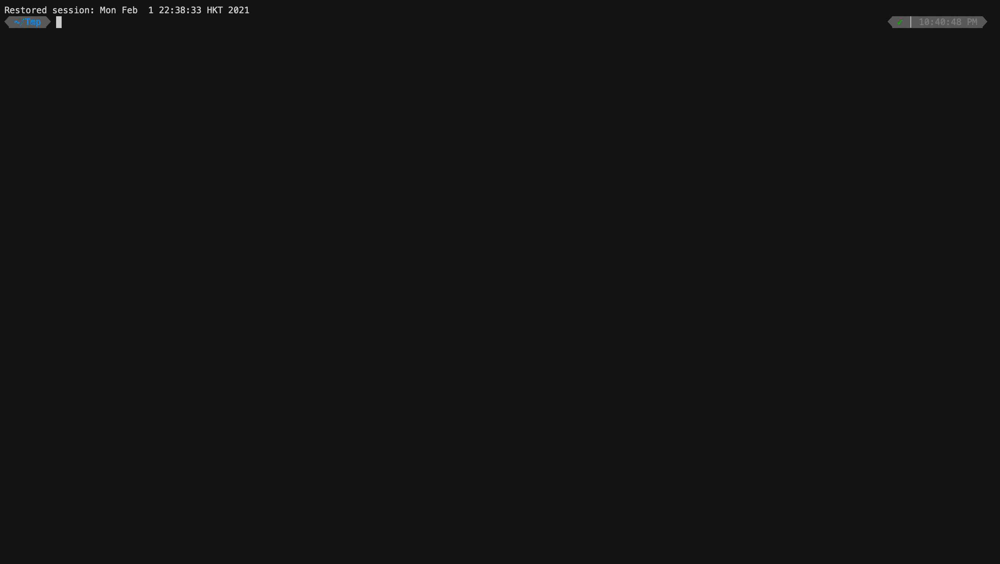
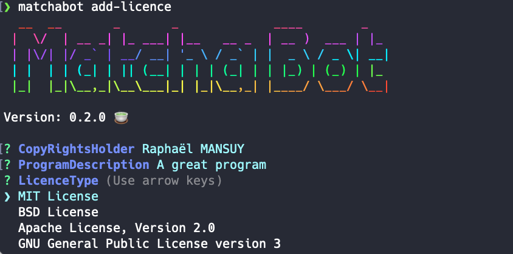

# MatchaBot

## Introduction

🍵 **MatchaBot** is a code generator written in TypeScript.



You can use **matchabot** to **create an entire project**, or to **generate code inside** an existing project in a consistent way.

This project has been created to offer a "Ruby on Rail" like programming experience with "React Projects".

### Features

- ✅ Easy to use **in project** generator
- ✅ You can create your **own generator by project**, or use a **global templates repository**
- ✅ Templating language support: [HandleBars](https://handlebarsjs.com/) and [EJS](https://ejs.co/)
- ✅ Powerfull command line support: automatic **CLI arguments** and **automatic prompts** for missing arguments
- ✅ Simplified workflow to create **new generators** for you **own project**
- ✅ Debug mode
- ✅ **Add new file** to your project
- ✅ **Modify existing files**
- ✅ You can generate **any kind of files/projects** (NodeJS, typescript, Javascript, SQL, C++, C, Go, ...)

### Benefits

- ✅ **Simple** and **Powerfull**
- ✅ **Save time** and **Boost** your **productivty**
- ✅ Enforce a **consistent** project structure
- ✅ **Easier** team onboarding with a codified best practices stored inside each project
- ✅ Fun to use 🦄

### Key concepts

- 👉 A **code generator** is identified by a **name**
- 👉 A **code generator** offer one or more **commands**
- 👉 A **command** takes a list of **arguments** as input and execute a list of **actions** ⚙️.
- 👉 ️️A **generator action** is specified by one or multiple **template** written with a templating language such as [HandleBars](https://handlebarsjs.com/) or [EJS](https://ejs.co/)
- 👉 The generators definitions are stored inside your project inside the **`./_machatbot`** directory
- 👉 **commands** are defined by a **`matcha.json`** file inside the **`./_machatbot`** directory


### How to start

**Add matchabot to your project**

Execute the following command at the root of your project.

```bash
yarn add matchabot --dev
```

or

```bash
npm install matchabot --save-dev
```


**Initialise matchabot**

Execute the following command at the root of your project.

```bash
matchabot init
```

👉 This command create a local directory **`./.matchabot`** inside your project

```bash
./.matchabot
└── commands
    ├── add-command
    ├── add-licence
```

The **command** directory contains a list of subdirectory. Each subdirectory contains a **matcha.json** file that defines the **command** and a list of asociated **templates**.

Example **`./.matchabot/add-licence/matcha.json`**:

```json
{
  "name": "add-licence",
  "description": "add a licence file to your project",
  "version": "1.0.0",
  "args": [
    {
      "name": "CopyRightsHolder",
      "alias": "c",
      "type": "string",
      "default": "{{process.env.LOGNAME}}"
    },
    {
      "name": "ProgramDescription",
      "alias": "p",
      "type": "string"
    },
    {
      "name": "LicenceType",

      "type": "list",
      "choices": [
        { "name": "MIT License", "value": "mit" },
        { "name": "BSD License", "value": "bsd" },
        { "name": "Apache License, Version 2.0", "value": "apache2" },
        { "name": "GNU General Public License version 3", "value": "gnu3" }
      ],
      "default": "MIT"
    }
  ],
  "actions": [
    {
      "type": "template",
      "name": "Generate Licence",
      "source": "{{toLowerCase LicenceType}}.md.hbs",
      "target": "LICENCE.md"
    }
  ]
}
```

**List availables commands**

```bash
matchabot list
```

👉 This command gives the list of defined commands

```bash
  __  __       _       _             ____        _
 |  \/  | __ _| |_ ___| |__   __ _  | __ )  ___ | |_
 | |\/| |/ _` | __/ __| '_ \ / _` | |  _ \ / _ \| __|
 | |  | | (_| | || (__| | | | (_| | | |_) | (_) | |_
 |_|  |_|\__,_|\__\___|_| |_|\__,_| |____/ \___/ \__|

Version: 0.2.0 🍵

┌─────────┬──────────────────────────┬──────────────────────────────────────────────────────────────┬─────────┬────────────────────────────────────────────────┐
│ (index) │           name           │                         description                          │ version │                    location                    │
├─────────┼──────────────────────────┼──────────────────────────────────────────────────────────────┼─────────┼────────────────────────────────────────────────┤
│    0    │      'add-command'       │       'add a new command to the .matchabot directory'        │ '1.0.0' │      './.matchabot/commands/add-command'       │
│    1    │      'add-licence'       │             'add a licence file to your project'             │ '1.0.0' │      './.matchabot/commands/add-licence'       │
│    2    │    'create-react-app'    │               'create a typescript react app'                │ '1.0.0' │    './.matchabot/commands/create-react-app'    │
│    3    │ 'create-react-component' │ 'generate a Styled React Component, and an associated story' │ '1.0.0' │ './.matchabot/commands/create-react-component' │
└─────────┴──────────────────────────┴──────────────────────────────────────────────────────────────┴─────────┴────────────────────────────────────────────────┘

```

**Execute a command**

```bash
matchabot add-licence
```

**Result:**



##
